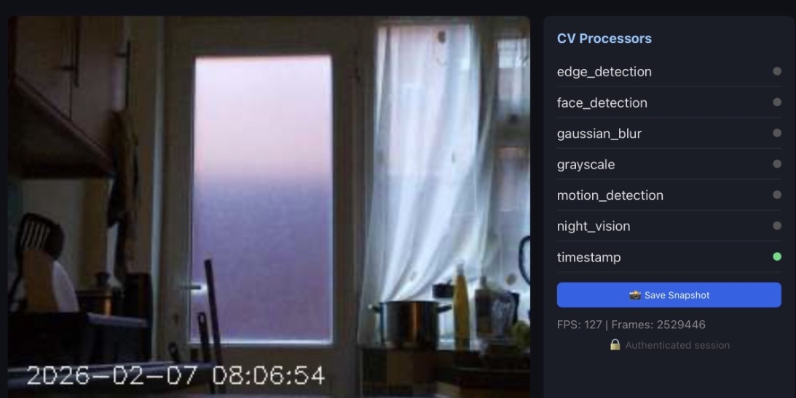
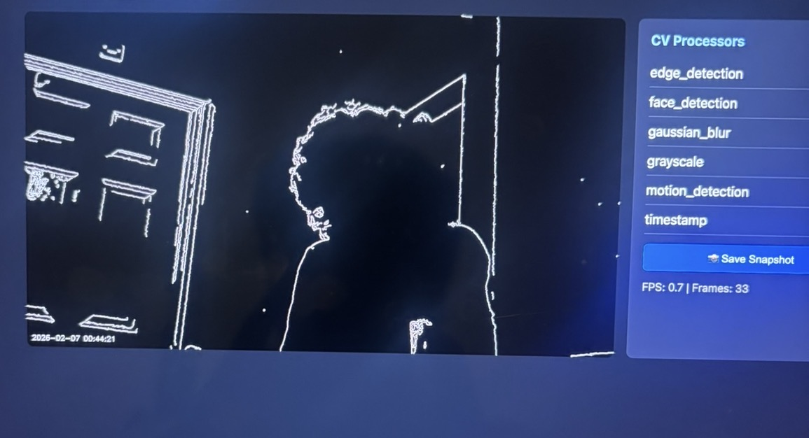
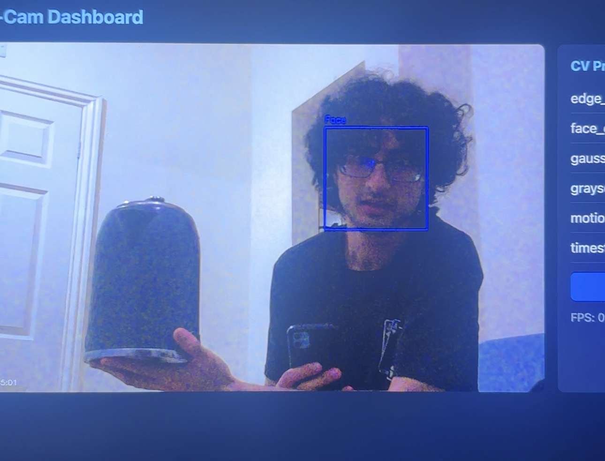

# Home Security Camera

A stranger broke into my uni student house. We didn't notice until later that evening. The door remained broken and unlocked.

Most people would call their landlord and leave it there. Since our landlord wasn't doing anything about it that day, I built a security camera system.

By the end of that same night, a Raspberry Pi Zero W was mounted, streaming live video through a custom Flask backend hosted on Google Cloud Platform with real-time object detection, edge detection, motion alerts, and night-mode via histogram equalisation. Port-forwarded through the router so every housemate could check the front door from anywhere, at any time, on any device.

---





---

## What it does

- Reads an MJPEG stream from the Pi in a background thread with auto-reconnect
- Allows for use of multiple CV processors: greyscale, edge detection, motion detection, face detection, getting the timestamp
- Lets you toggle processors and save snapshots
- Serves both raw and processed feeds
- Uses a REST API for status, processor control, and snapshots

## Setup

```bash
pip install flask opencv-python numpy
python backend.py --stream-url http://<pi-address>:8080/stream
```

## CV Processors

| Name               | Description                                     |
| ------------------ | ----------------------------------------------- |
| `greyscale`        | Converts to greyscale                           |
| `edge_detection`   | Canny edge detection                            |
| `gaussian_blur`    | Gaussian blur (15×15)                           |
| `motion_detection` | MOG2 background subtraction with bounding boxes |
| `face_detection`   | Haar cascade face detection                     |
| `night_vision`     | Histogram equalisation for low-light footage    |
| `timestamp`        | Overlays current timestamp (on by default)      |

Add your own by registering a `(np.ndarray) -> np.ndarray` callable via `pipeline.register()`.
